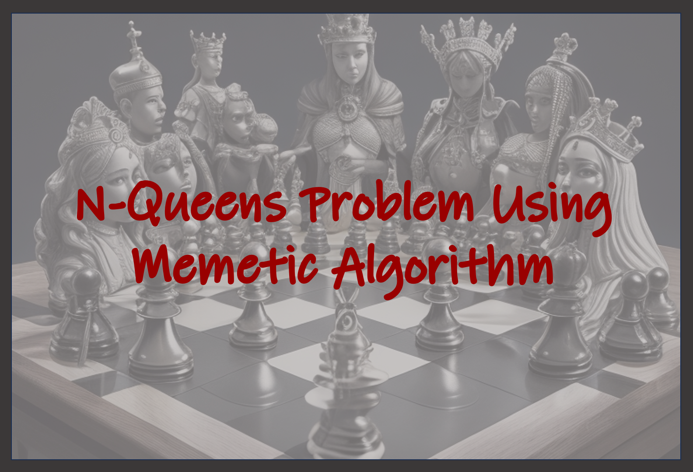

# NQueens-Problem-Using-Memetic-Algorithm

## Introduction

The N Queens puzzle is a classic problem in combinatorial optimization. It involves placing N chess queens on an N×N chessboard in such a way that no two queens threaten each other. This means that no two queens should share the same row, column, or diagonal. This project implements a Memetic Algorithm in Python to find a valid placement of N queens on the chessboard.

## Algorithm Overview

1. **Population Generation**: We start by generating a population of random permutations of numbers from 0 to N, representing queen placements. These permutations ensure that queens do not share rows or columns.

2. **Fitness Function**: The fitness of each solution is calculated by counting the number of queens that threaten each other, i.e., queens that share the same row, column, or diagonal. A higher fitness score indicates fewer threats.

3. **Parent Selection**: Parents for the next generation are chosen based on their fitness. Approximately 60% of chromosomes are selected as parents to maintain genetic diversity.

4. **Crossover (Order Recombination)**: Parents produce children using order recombination. Two parents are randomly selected, and a random range is chosen. The child inherits numbers within this range from one parent and the remaining numbers from the other. This introduces genetic diversity.

5. **Local Search**: Some children undergo a local search, where pairs of random positions in a chromosome are swapped. This simple adjacency definition helps explore the solution space.

6. **Mutation**: Around 10% of children undergo mutation, involving shuffling a random range of positions in the chromosome. Mutation prevents premature convergence.

7. **Population Update**: The best-performing children replace the worst-performing solutions in the population, ensuring evolutionary progress.

8. **Termination**: The algorithm continues until the minimum fitness reaches zero, indicating a valid queen placement.

## Parameters

- **Population Size**: 25
- **Parent Selection Rate**: 60%
- **Crossover Rate**: 80%
- **Mutation Rate**: 10%

## Performance Factors

Several factors influence algorithm performance:

- **Genetic Diversity**: Maintaining diversity through crossover and mutation prevents premature convergence.

- **Local Search**: Local search introduces randomness and exploration.

- **Population Size**: Larger populations may find better solutions but require more resources.

- **Termination Criteria**: The algorithm continues until a valid solution is found, so time to reach a solution varies.

- **Parameter Tuning**: Fine-tuning parameters impacts speed and performance.

## Dependencies

- Python
- NumPy
- Pandas
- Matplotlib
